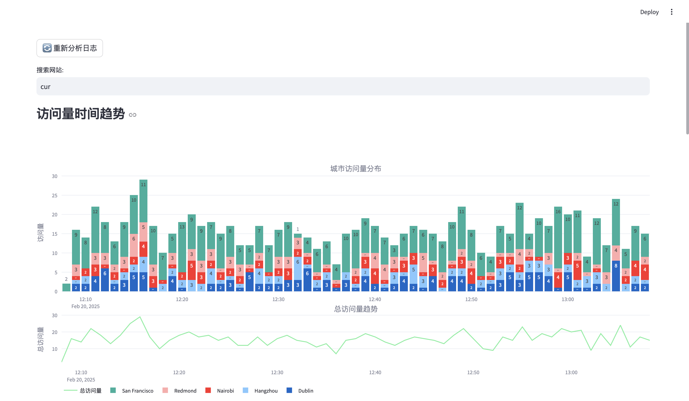
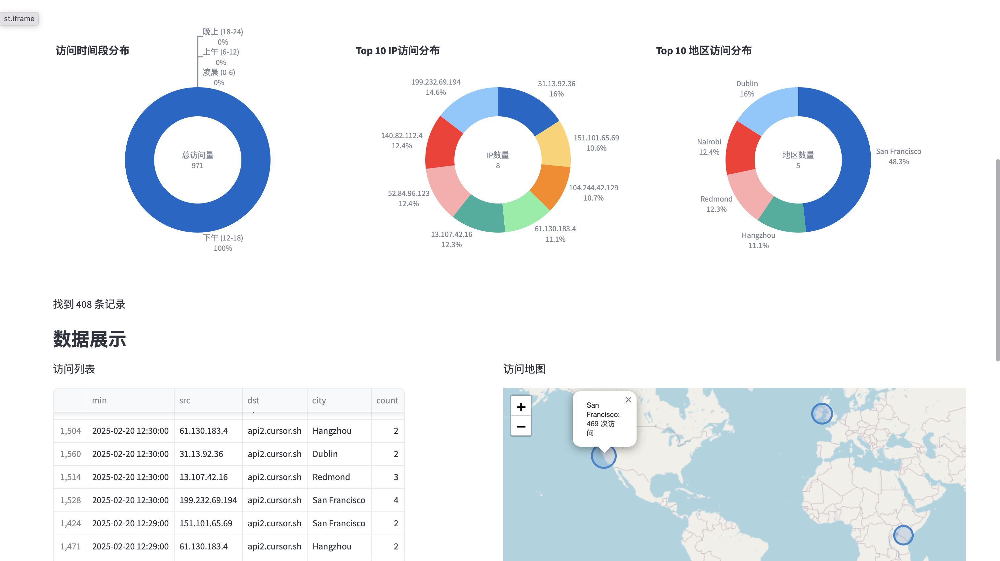
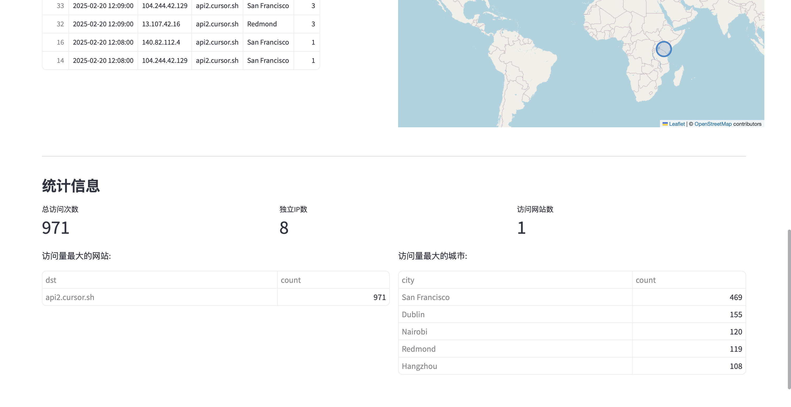

# V2Log - Access Log Analyzer

一个基于 Streamlit 的访问日志分析器，提供可视化的日志分析功能。

> 本项目98%内容由 Cursor 生成







## 功能特点

- 日志分析
- 地理位置可视化
- 访问量时间趋势
- 城市分布统计
- 搜索和过滤功能
- 分页数据展示

## 安装说明

通过 pip 安装

```bash
pip install v2log
```

## 使用说明

可以通过如下命令运行测试应用

```bash
v2log --demo
```

日志分析器支持通过命令行参数指定日志文件路径：

```bash
v2log access.log
```


## 项目结构

```
├── dev.py
├── v2log
│   ├── __init__.py
│   ├── analyzer.py
│   ├── app.py
│   ├── cli.py
│   ├── components.py
│   ├── data
│   │   └── IP2LOCATION-LITE-DB11.BIN
│   └── utils
│       ├── __init__.py
│       ├── generator.py
│       └── helpers.py
├── requirements.txt
└── setup.py
```
